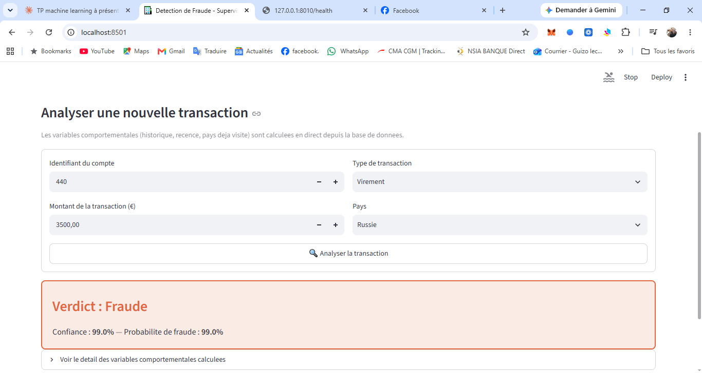
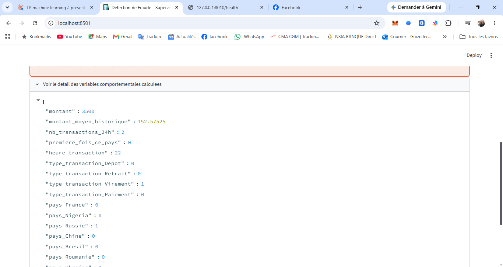
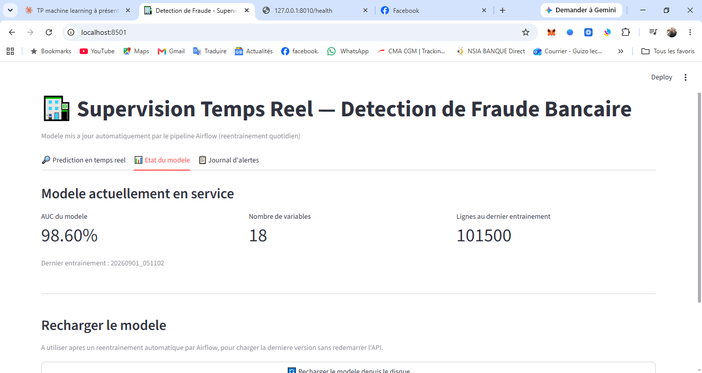

# 🏦 Détection de Fraude Bancaire en Temps Réel — Pipeline Data Engineering + MLOps

Système complet de détection de fraude bancaire combinant **ingénierie de données**, **Machine Learning**, et **orchestration automatisée** : de l'entrepôt de données PostgreSQL jusqu'à une interface de supervision en temps réel, avec ré-entraînement automatique du modèle.

## 🎯 Vue d'ensemble du projet

Ce projet simule un système bancaire réel où :
- Des transactions arrivent en continu dans une base de données
- Un pipeline **Apache Airflow** automatise l'ingestion et le ré-entraînement du modèle
- Une **API FastAPI** calcule des variables comportementales en temps réel et sert des prédictions
- Une **interface Streamlit** permet à un opérateur d'analyser des transactions et de superviser le modèle

```
┌──────────────┐     ┌───────────────────┐     ┌──────────────────┐
│   Airflow     │────▶│   PostgreSQL       │◀────│   FastAPI +      │
│  (Docker)     │     │  (donnees + vue    │     │   Streamlit      │
│  Orchestration│     │   SQL features)    │     │  Interface temps │
│  automatisee  │     │                    │     │  reel            │
└──────────────┘     └───────────────────┘     └──────────────────┘
```

## 🛠️ Stack technique

| Domaine | Outils |
|---|---|
| Base de données | PostgreSQL, SQL (window functions) |
| Orchestration | Apache Airflow 2.9.3, Docker, Docker Compose |
| Machine Learning | scikit-learn (Random Forest), pandas, SQLAlchemy |
| API & Interface | FastAPI, Streamlit |
| Langage | Python 3.12 |

## 📊 Le jeu de données

Base de données relationnelle normalisée à 3 tables :
- **`clients`** — informations client (segment Particulier/Professionnel)
- **`comptes`** — comptes bancaires rattachés aux clients
- **`transactions`** — flux de transactions avec l'étiquette cible `est_fraude`

~100 000+ transactions générées avec des **patterns de fraude réalistes** (montants anormaux, pays étrangers, horaires atypiques).

## 📸 Aperçu de l'interface

**Détection en temps réel avec explication de la décision :**



**Détail des variables comportementales calculées :**



**Suivi de l'état du modèle (mis à jour automatiquement par Airflow) :**



## 🔍 Feature Engineering en SQL

Plutôt que de tout calculer en pandas, les variables comportementales sont calculées **directement en SQL** via des fonctions de fenêtre (window functions), exposées dans une vue réutilisable (`vue_features_transactions`) :

```sql
-- Exemple : moyenne historique du compte, EXCLUANT la transaction courante (anti data-leakage)
AVG(montant) OVER (
    PARTITION BY compte_id
    ORDER BY date_transaction
    ROWS BETWEEN UNBOUNDED PRECEDING AND 1 PRECEDING
) AS montant_moyen_historique
```

**Variables calculées :**
- `montant_moyen_historique` — comportement habituel du compte
- `nb_transactions_24h` — fenêtre glissante de 24h (détection de rafales)
- `premiere_fois_ce_pays` — détection de destination inhabituelle
- `heure_transaction` — pattern horaire

Voir [`schema.sql`](./schema.sql) pour le détail complet.

## 🤖 Modélisation

5 algorithmes comparés (Régression Logistique, KNN, Naive Bayes, SVM, Random Forest), avec gestion explicite du déséquilibre de classes (`class_weight="balanced"`, ~3% de fraude).

**Modèle retenu : Random Forest**
- **AUC-ROC : ~0.986-0.99**
- Precision élevée (peu de fausses alertes) — critère prioritaire pour l'expérience utilisateur bancaire

## ⚙️ Pipeline Airflow

Un DAG à 3 tâches, planifié quotidiennement (`schedule="@daily"`) :

```
generer_transactions  →  verifier_pipeline  →  reentrainer_modele_si_necessaire
```

1. **Génère** de nouvelles transactions (simulation d'un flux réel) et les insère en base
2. **Vérifie** la cohérence entre la table brute et la vue de features
3. **Ré-entraîne** automatiquement le modèle si suffisamment de nouvelles données sont arrivées (seuil configurable), et sauvegarde le nouveau modèle avec ses métadonnées (AUC, horodatage)

Voir [`dags/pipeline_fraude.py`](./dags/pipeline_fraude.py).

## 🖥️ API & Interface

**API FastAPI** (`main.py`) :
- `POST /predict` — calcule les features en temps réel depuis la base et retourne une prédiction avec niveau de confiance
- `GET /model-info` — métadonnées du modèle actuellement en service
- `POST /reload-model` — recharge le modèle à chaud après un ré-entraînement Airflow, sans redémarrer l'API

**Interface Streamlit** (`app.py`) :
- Formulaire de prédiction interactif avec détail explicable des variables calculées
- Tableau de bord de suivi du modèle (AUC, date de dernier entraînement)
- Journal d'alertes de la session

## 🚀 Lancer le projet

### Prérequis
- Python 3.10+, PostgreSQL, Docker Desktop

### 1. Base de données
```bash
psql -U postgres -f schema.sql
```

### 2. Génération des données initiales
```bash
python generer_donnees.py
```

### 3. Pipeline Airflow (Docker)
```bash
docker compose build
docker compose up airflow-init
docker compose up -d
```
Interface Airflow : http://localhost:8080 (airflow/airflow)

### 4. API + Interface
```bash
uvicorn main:app --host 0.0.0.0 --port 8010
streamlit run app.py
```

## 📈 Résultats clés

| Métrique | Valeur |
|---|---|
| Transactions traitées | 100 000+ |
| Taux de fraude | ~3% |
| AUC-ROC (modèle retenu) | ~0.98-0.99 |
| Variables du modèle | 18 (après encodage) |
| Fréquence de ré-entraînement | Automatique, quotidienne |

## 🎓 Compétences démontrées

- Modélisation de bases de données relationnelles et normalisation
- Feature engineering avancé en SQL (window functions)
- Gestion du déséquilibre de classes en classification
- Orchestration de pipelines de données (Apache Airflow, DAGs)
- Conteneurisation (Docker, Docker Compose)
- Développement d'API (FastAPI) et d'interfaces de supervision (Streamlit)
- Débogage d'infrastructure en conditions réelles (gestion mémoire, compatibilité de versions, exécuteurs Airflow)

---

*Projet réalisé dans le cadre d'un apprentissage pratique en Data Engineering et Machine Learning.*
